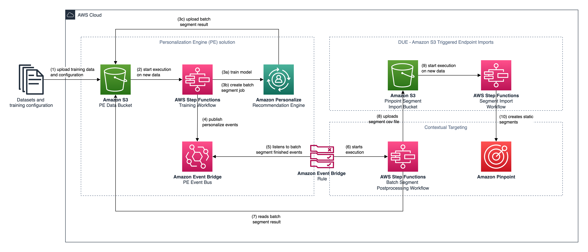
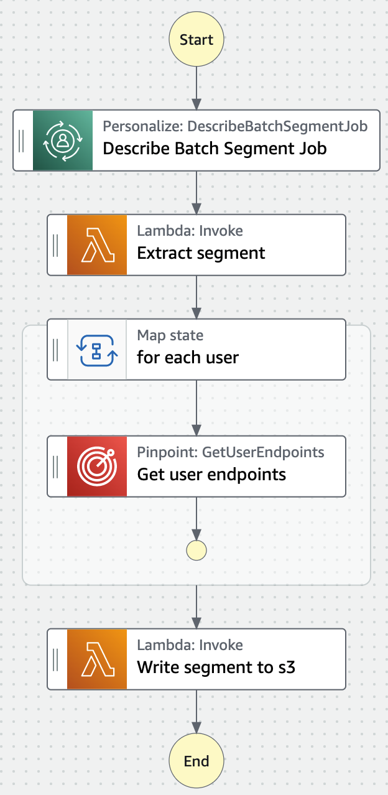
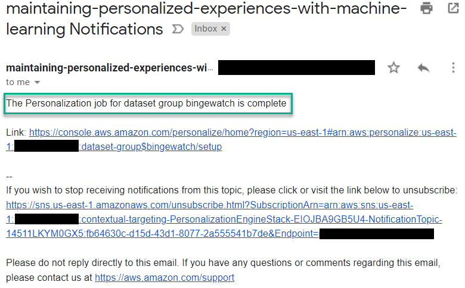
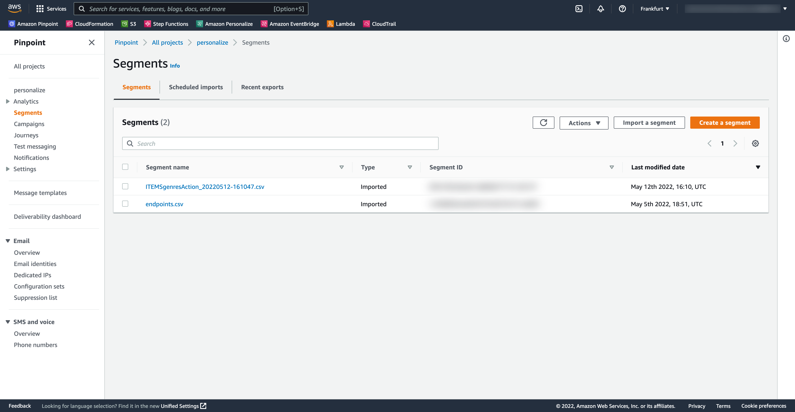

# Target your customers with ML based on their interest in a product or product attribute.

This is the solution for the AWS blog post [Target your customers with ML based on their interest in a product or product attribute.](#). This solution is based on the following reference architectures:

- [Maintaining Personalized Experiences with Machine Learning](https://aws.amazon.com/solutions/implementations/maintaining-personalized-experiences-with-ml/)
- [Amazon S3 Triggered Endpoint Imports](https://github.com/aws-samples/communication-developer-services-reference-architectures#Amazon-S3-Triggered-Endpoint-Imports)

Both of these architectures are deployed as nested stacks along the main solution to showcase how contextual segmentation can be implemented by integrating Amazon Personalize with Amazon Pinpoint.

## High Level Architecture



Once training data and training configuration are uploaded to the personalize data bucket (1) an AWS Step Function state machine is executed (2). This state machine implements a training workflow to provision all required resources within Amazon Personalize. It trains a recommendation model (3a) based on the [Item-Attribute-Affinity recipe](https://docs.aws.amazon.com/personalize/latest/dg/item-attribute-affinity-recipe.html). Once the solution is created, the workflow will create a batch segment job to get user segments (3b). The job configuration focuses on providing segments of users that are interested in action genre movies

```sh
{ "itemAttributes": "ITEMS.genres = \"Action\"" }
```

Once the batch segment job has been finished, the result is uploaded to Amazon S3 (3c). The training workflow state machine publishes Amazon Personalize state changes on a custom event bus (4). An Amazon Event Bridge rule listens on events describing that a batch segment job has finished (5). Once this event is put on the event bus, a batch segment postprocessing workflow is executated as AWS Step Function state machine (6). This workflow reads and transforms the segment job output from Amazon Personalize (7) into a CSV file that can be imported as static segment into Amazon Pinpoint (8). The CSV file contains only the Amazon Pinpoint endpoint-ids to provide pointer to the corresponding endpoints from our recommendation segment like

```csv
Id
hcbmnng30rbzf7wiqn48zhzzcu4
tujqyruqu2pdfqgmcgkv4ux7qlu
keul5pov8xggc0nh9sxorldmlxc
lcuxhxpqh/ytkitku2zynrqb2ce
```

The mechanism to resolve an Amazon Pinpoint endpoint id relies on the user id that is set in Amazon Personalize to be also referenced in each endpoint within Amazon Pinpoint [using the user id attribute](https://docs.aws.amazon.com/pinpoint/latest/developerguide/audience-define-user.html).



The workflow ensures, that the segment file has a unique filename so that the segments within Amazon Pinpoint can be identified independently. Once the segment CSV file is uploaded to S3 (7), the segment import workflow creates a new static segment withing Amazon Pinpoint (8).

## Datasets

The solution uses artificially generated datasets for demonstration purposes in the context of an artifical video streaming company named "Bingewatch". Bingewatch has the broadest offering of movies in the world. After users watched a movie they are asked to give a rating from 1 to 5 stars. This rating is used to personalize the experience based on the unique watch behaviour of a user.

- Interactions’ metadata created out of the Bingewatch `ratings.csv`
- Items’ metadata created out of the Bingewatch `movies.csv`
- users’ metadata created out of the Bingewatch `ratings.csv`, enriched with invented data about e-mail address and age
- Amazon Pinpoint endpoint data

### Interactions’ dataset

The interaction dataset describes movie ratings from Bingewatch users. Each row describes a single rating by a user identified by a user id.

The `EVENT_VALUE` describes the actual rating from 1 to 5 and the `EVENT_TYPE` specifies that the rating resulted because a user watched this movie at the given `TIMESTAMP`.

```csv
USER_ID,ITEM_ID,EVENT_VALUE,EVENT_TYPE,TIMESTAMP
1,1,4.0,Watch,964982703
2,3,4.0,Watch,964981247
3,6,4.0,Watch,964982224
...
```

### Items’ dataset

The item dataset describes each available movie using a `TITLE`, `RELEASE_YEAR`, `CREATION_TIMESTAMP` and a pipe concatenated list of `GENRES`.

```csv
ITEM_ID,TITLE,RELEASE_YEAR,CREATION_TIMESTAMP,GENRES
1,Toy Story,1995,788918400,Adventure|Animation|Children|Comedy|Fantasy
2,Jumanji,1995,788918400,Adventure|Children|Fantasy
3,Grumpier Old Men,1995,788918400,Comedy|Romance
...
```

### Users' dataset

The users dataset contains all known users identified by a `USER_ID`. This dataset contains artificially generated metadata that describe the users’ `GENDER` and `AGE`, as shown in the following example:

```csv
USER_ID,GENDER,E_MAIL,AGE
1,Female,success1@simulator.amazonses.com,21
2,Female,success+2@simulator.amazonses.com,35
3,Male,success+3@simulator.amazonses.com,37
4,Female,success+4@simulator.amazonses.com,47
5,Agender,success+5@simulator.amazonses.com,50
...
```

### Amazon Pinpoint endpoints

To map Amazon Pinpoint endpoints to users in Amazon Personalize, it is important to have a consisted user identifier. The mechanism to resolve an Amazon Pinpoint endpoint id relies that the user id in Amazon Personalize is also referenced in each endpoint within Amazon Pinpoint [using the user id attribute](https://docs.aws.amazon.com/pinpoint/latest/developerguide/audience-define-user.html).

```csv
User.UserId,ChannelType,User.UserAttributes.Gender,Address,User.UserAttributes.Age
1,EMAIL,Female,success+1@simulator.amazonses.com,21
2,EMAIL,Female,success+2@simulator.amazonses.com,35
3,EMAIL,Male,success+3@simulator.amazonses.com,37
4,EMAIL,Female,success+4@simulator.amazonses.com,47
5,EMAIL,Agender,success+5@simulator.amazonses.com,50
...
```

## Solution implementation

### Prerequisites

To deploy this solution, you must have the following:

- An [AWS account](https://signin.aws.amazon.com/signin?redirect_uri=https%3A%2F%2Fportal.aws.amazon.com%2Fbilling%2Fsignup%2Fresume&client_id=signup)
- The AWS CLI on your local machine. For more information see [Installing the AWS CLI](https://docs.aws.amazon.com/cli/latest/userguide/getting-started-install.html) guide.
- The SAM CLI on your local machine. For more information, see [Install the SAM CLI](https://docs.aws.amazon.com/serverless-application-model/latest/developerguide/serverless-sam-cli-install.html) in the AWS Serverless Application Model Developer guide.
- The latest version of Boto3. For more information see [Installation](https://boto3.amazonaws.com/v1/documentation/api/latest/guide/quickstart.html) in the Boto3 Documentation. 

**Note:** This solution creates an Amazon Pinpoint project with the name **personalize**. If you want to deploy this solution on an existing Amazon Pinpoint project, you will need to perform changes in the YAML template.

### Deploy the solution

#### Step 1: Deploy the SAM application

[Clone the repository to your local machine](https://docs.github.com/en/repositories/creating-and-managing-repositories/cloning-a-repository), navigate there and execute the command below on your SAM CLI:

```sh
sam deploy --stack-name contextual-targeting --guided
```

Fill the fields below as displayed. Change the **AWS Region** to the AWS region of your preference, where Amazon Pinpoint and Amazon Personalize are available. The **Parameter Email** is used from SNS to send you an email notification when the Amazon Personalize job is completed. 

```sh
Configuring SAM deploy
======================

        Looking for config file [samconfig.toml] :  Not found

        Setting default arguments for 'sam deploy'
        =========================================
        Stack Name [sam-app]: contextual-targeting
        AWS Region [us-east-1]: eu-central-1
        Parameter Email []: me@example.com
        Parameter PEVersion [v1.2.0]:
        Parameter SegmentImportPrefix [pinpoint/]:
        #Shows you resources changes to be deployed and require a 'Y' to initiate deploy
        Confirm changes before deploy [y/N]:
        #SAM needs permission to be able to create roles to connect to the resources in your template
        Allow SAM CLI IAM role creation [Y/n]:
        #Preserves the state of previously provisioned resources when an operation fails
        Disable rollback [y/N]:
        Save arguments to configuration file [Y/n]:
        SAM configuration file [samconfig.toml]:
        SAM configuration environment [default]:

        Looking for resources needed for deployment:
        Creating the required resources...
        [...]
        Successfully created/updated stack - contextual-targeting in eu-central-1

```

#### Step 2: Import the initial segment to Amazon Pinpoint

We will import some dummy endpoints to Amazon Pinpoint.

Execute the command below to your AWS CLI in your local machine. 

The command below is compatible for Linux:
```sh
SEGMENT_IMPORT_BUCKET=$(aws cloudformation describe-stacks --stack-name contextual-targeting --query 'Stacks[0].Outputs[?OutputKey==`SegmentImportBucket`].OutputValue' --output text)
aws s3 sync ./data/pinpoint s3://$SEGMENT_IMPORT_BUCKET/pinpoint
```

For Windows PowerShell use the command below:
```sh
$SEGMENT_IMPORT_BUCKET = (aws cloudformation describe-stacks --stack-name contextual-targeting --query 'Stacks[0].Outputs[?OutputKey==`SegmentImportBucket`].OutputValue' --output text)
aws s3 sync ./data/pinpoint s3://$SEGMENT_IMPORT_BUCKET/pinpoint
```

#### Step 3: Upload training data and configuration for Amazon Personalize

Now we are ready to train our initial recommendation model. This solution provides you with dummy training data as well as a training/inference configuration, which needs to be uploaded into the Amazon Personalize S3 bucket.

Execute the command below to your AWS CLI in your local machine. 

The command below is compatible for Linux:
```sh
PERSONALIZE_BUCKET=$(aws cloudformation describe-stacks --stack-name contextual-targeting --query 'Stacks[0].Outputs[?OutputKey==`PersonalizeBucketName`].OutputValue' --output text)
aws s3 sync ./data/personalize s3://$PERSONALIZE_BUCKET
```

For Windows PowerShell use the command below:
```sh
$PERSONALIZE_BUCKET = (aws cloudformation describe-stacks --stack-name contextual-targeting --query 'Stacks[0].Outputs[?OutputKey==`PersonalizeBucketName`].OutputValue' --output text)
aws s3 sync ./data/personalize s3://$PERSONALIZE_BUCKET
```

> ⚠️ Time for some ☕ .It can take between 45 and 60 minutes until the training process is completed.

#### Step 4: Review the infered segments from Amazon Personalize

Once the training workflow is completed, you should receive an email on the email address you provided when deploying the stack. The email should look like the one in the screenshot below:



Navigate to the **Amazon Pinpoint Console > Your Project > Segments** and you should see two imported segments. One named endpoints.csv that contains all imported endpoints from Step 2. And then a segment named ITEMSgenresAction_<date>-<time>.csv that contains the ids of endpoints that are interested in action movies inferred by Amazon Personalize



You can engage with Amazon Pinpoint customer segments via Campaigns and Journeys. For more information on how to create and execute Amazon Pinpoint Campaigns and Journeys visit the workshop [Building Customer Experiences with Amazon Pinpoint](https://catalog.workshops.aws/amazon-pinpoint-customer-experience/en-US). 

## Next steps

Contextual targeting is not bound to a single channel, like in this solution email. You can extend the **batch-segmentation-postprocessing** workflow to fit your engagement and targeting requirements.

For example, you could implement several branches based on the referenced endpoint channel types and create Amazon Pinpoint customer segments that can be engaged via Push Notifications, SMS, Voice Outbound and In-App.

## Cleanup

To delete the solution, run the following command in the AWS CLI.

The command below is compatible with Linux:

```sh
SEGMENT_IMPORT_BUCKET=$(aws cloudformation describe-stacks --stack-name contextual-targeting --query 'Stacks[0].Outputs[?OutputKey==`SegmentImportBucket`].OutputValue' --output text)
PERSONALIZE_BUCKET=$(aws cloudformation describe-stacks --stack-name contextual-targeting --query 'Stacks[0].Outputs[?OutputKey==`PersonalizeBucketName`].OutputValue' --output text)
aws s3 rm s3://$SEGMENT_IMPORT_BUCKET/ --recursive
aws s3 rm s3://$PERSONALIZE_BUCKET/ --recursive
sam delete
```

For Windows PowerShell use the command below:
```sh
$SEGMENT_IMPORT_BUCKET=$(aws cloudformation describe-stacks --stack-name contextual-targeting --query 'Stacks[0].Outputs[?OutputKey==`SegmentImportBucket`].OutputValue' --output text)
$PERSONALIZE_BUCKET=$(aws cloudformation describe-stacks --stack-name contextual-targeting --query 'Stacks[0].Outputs[?OutputKey==`PersonalizeBucketName`].OutputValue' --output text)
aws s3 rm s3://$SEGMENT_IMPORT_BUCKET/ --recursive
aws s3 rm s3://$PERSONALIZE_BUCKET/ --recursive
sam delete
```

Amazon Personalize resources like Dataset groups, datasets, etc. are not created via Cloudformation, thus you have to delete them manually. Please follow the instructions in the [official AWS documentation](https://docs.aws.amazon.com/personalize/latest/dg/gs-cleanup.html) on how to clean up the created resources.
